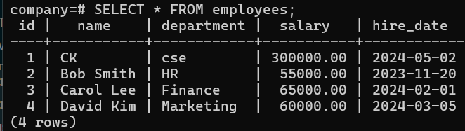
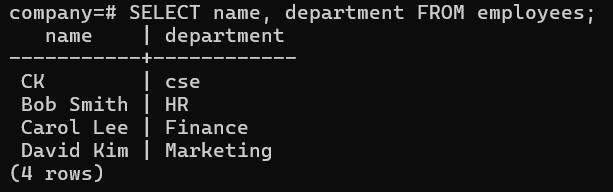

# Overview

- [Overview](#overview)
- [Select Statement](#select-statement)
- [What is SELECT](#what-is-select)
- [Syntax](#syntax)
  - [Retrieve all data](#retrieve-all-data)
    - [Interview Tip:](#interview-tip)
  - [Select specific columns](#select-specific-columns)
  - [Remove duplicates with DISTINCT](#remove-duplicates-with-distinct)
  - [Column Aliasing](#column-aliasing)
    - [💡 Shortcut:](#-shortcut)
  - [SELECT with Expressions](#select-with-expressions)
  - [SELECT with Strings](#select-with-strings)
  - [Key Clauses with SELECT](#key-clauses-with-select)
  - [SELECT with CASE (Conditional Logic)](#select-with-case-conditional-logic)
  - [SELECT with NULL Handling](#select-with-null-handling)
  - [SELECT with Multiple Conditions](#select-with-multiple-conditions)
- [SELECT with Subquery (Intro Level)](#select-with-subquery-intro-level)
- [Example](#example)
  - [Select all columns](#select-all-columns)
  - [Select specific columns](#select-specific-columns-1)
  - [Remove duplicates with DISTINCT](#remove-duplicates-with-distinct-1)
  - [Use expressions in SELECT](#use-expressions-in-select)
  - [Combine text with CONCAT](#combine-text-with-concat)
- [In short](#in-short)

&nbsp;

&nbsp;

&nbsp;

# Select Statement

`SELECT` command is used to retrieve data from a database table. It belongs to DQL (Data Query Language).

&nbsp;

&nbsp;

# What is SELECT

`SELECT` is used to:

- Fetch data from one or more tables
- Filter, sort, and group results
- Perform calculations on data

&nbsp;

&nbsp;

# Syntax

## Retrieve all data

```sql
SELECT * FROM table_name;
```

👉 \* means all columns

&nbsp;

#### Interview Tip:

- Avoid SELECT \* in production (performance issue)
- Always specify columns

&nbsp;

&nbsp;

## Select specific columns

```sql
SELECT column1, column2, ...
FROM table_name;
```

👉 Returns only selected columns

&nbsp;

&nbsp;

## Remove duplicates with DISTINCT

```sql
SELECT DISTINCT column_name
FROM table_name;
```

👉 Returns only unique values.

&nbsp;

&nbsp;

## Column Aliasing

SQL aliases are used to give a column or a table a temporary name.

```sql
SELECT first_name AS fname, salary AS emp_salary
FROM employees;
```

👉 Rename columns using `AS`

👉 Output will show:

- fname
- emp_salary

&nbsp;

#### 💡 Shortcut:

```sql
SELECT first_name fname FROM employees;
```

&nbsp;

&nbsp;

## SELECT with Expressions

```sql
SELECT salary, salary * 12 AS annual_salary
FROM employees;
```

👉 You can perform calculations

&nbsp;

&nbsp;

## SELECT with Strings

```sql
SELECT first_name || ' ' || last_name AS full_name
FROM customers;
```

👉 Combines columns

⚠️ In some DBs:

- Use CONCAT(first_name, last_name)

&nbsp;

&nbsp;

## Key Clauses with SELECT

A complete `SELECT` query can include:

```sql
SELECT column_list
FROM table_name
WHERE condition
GROUP BY column
HAVING condition
ORDER BY column;
```

👉 Actual execution order:

- FROM
- WHERE
- SELECT
- ORDER BY
- LIMIT

&nbsp;

&nbsp;

## SELECT with CASE (Conditional Logic)

```sql
SELECT name,
       salary,
       CASE
           WHEN salary > 50000 THEN 'High'
           WHEN salary > 30000 THEN 'Medium'
           ELSE 'Low'
       END AS salary_category
FROM employees;
```

👉 Used a LOT in real projects

&nbsp;

&nbsp;

## SELECT with NULL Handling

```sql
SELECT name, COALESCE(phone, 'Not Available') AS phone
FROM customers;
```

👉 Replaces NULL values

&nbsp;

&nbsp;

## SELECT with Multiple Conditions

```sql
SELECT *
FROM employees
WHERE department = 'IT'
AND salary > 40000;
```

&nbsp;

&nbsp;

# SELECT with Subquery (Intro Level)

```sql
SELECT name
FROM employees
WHERE salary > (
    SELECT AVG(salary) FROM employees
);
```

👉 Employees earning above average

&nbsp;

&nbsp;

# Example

## Select all columns

```sql
SELECT * FROM employees;
```



&nbsp;

👉 Returns all rows and columns from the **employees** table.

&nbsp;

&nbsp;

## Select specific columns

```sql
SELECT name, department
FROM employees;
```



&nbsp;

👉 Only shows name and department.

&nbsp;

&nbsp;

## Remove duplicates with DISTINCT

```sql
SELECT DISTINCT department
FROM employees;
```

👉 Returns only unique department names.

&nbsp;

&nbsp;

## Use expressions in SELECT

You can calculate values inside the query.

```sql
SELECT first_name, salary, salary * 12 AS annual_salary
FROM employees;
```

👉 Creates a new column annual_salary as salary × 12.

&nbsp;

&nbsp;

## Combine text with CONCAT

```sql
SELECT CONCAT(first_name, ' ', last_name) AS full_name
FROM employees;
```

👉 Combines first name and last name into full_name.

&nbsp;

&nbsp;

# In short

- `SELECT *` → everything
- `SELECT col1, col2` → specific columns
- `SELECT DISTINCT col` → unique values
- `SELECT col AS alias` → rename (aliasing) a column
- `SELECT expressions` → do calculations

&nbsp;

&nbsp;

&nbsp;

&nbsp;

&nbsp;

&nbsp;

&nbsp;

&nbsp;

&nbsp;

&nbsp;

&nbsp;

&nbsp;

&nbsp;

&nbsp;

&nbsp;

&nbsp;

&nbsp;

&nbsp;
