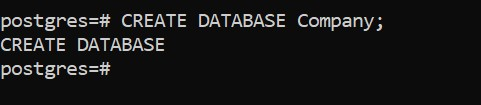
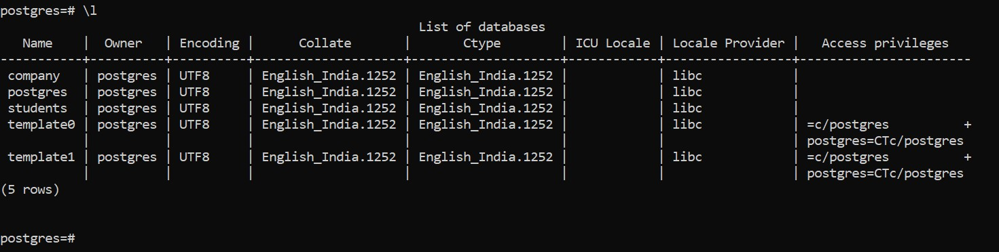

# Overview

- [Overview](#overview)
- [Database](#database)
- [Create database](#create-database)
  - [Syntax](#syntax)
  - [Example](#example)
- [Database list](#database-list)
  - [Syntax](#syntax-1)
- [Check current database](#check-current-database)
  - [Syntax](#syntax-2)
- [Go to particular database](#go-to-particular-database)
  - [Example](#example-1)

&nbsp;

&nbsp;

&nbsp;

# Database

Database is a **collection of similar and organized data** in a format that can be easily accessed.

&nbsp;

&nbsp;

# Create database

## Syntax

```sql
CREATE DATABASE database_name;
```

&nbsp;

## Example

```sql
CREATE DATABASE Company;
```



&nbsp;

&nbsp;

# Database list

In SQL shell we can simply type `\l` to see the existent Database

&nbsp;

## Syntax

```sql
\l
```



&nbsp;

&nbsp;

# Check current database

to see the current database, we use `SELECT current_database();`

&nbsp;

## Syntax

```sql
SELECT current_database();
```

&nbsp;

&nbsp;

# Go to particular database

To go to the database in SQL shell, we use `\c database_name`

## Example

```sql
\c company
```


Here `company` is the database name.

&nbsp;

&nbsp;

&nbsp;

&nbsp;
