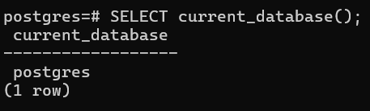
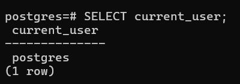
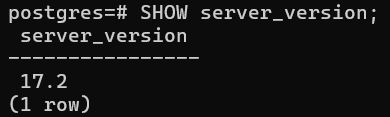
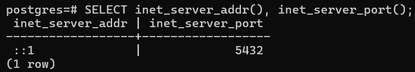

# Overview

- [Overview](#overview)
- [Current database name](#current-database-name)
- [Current user](#current-user)
- [Server version](#server-version)
- [Connection info](#connection-info)

&nbsp;

&nbsp;

&nbsp;

# Current database name

```sql
SELECT current_database();
```



&nbsp;

&nbsp;

# Current user

```sql
SELECT current_user;
```



&nbsp;

&nbsp;

# Server version

```sql
SHOW server_version;
```



&nbsp;

&nbsp;

# Connection info

```sql
SELECT inet_server_addr(), inet_server_port();
```


