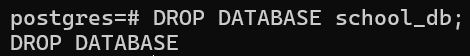

# Overview

- [Overview](#overview)
- [DROP](#drop)
- [Syntax](#syntax)
  - [Important Notes](#important-notes)
- [Drop current database](#drop-current-database)

&nbsp;

&nbsp;

&nbsp;

# DROP

This will permanently delete the database and all its data.

&nbsp;

&nbsp;

# Syntax

```sql
DROP DATABASE database_name;
```



&nbsp;

&nbsp;

## Important Notes

- You cannot be connected to the database you are trying to drop.

- You must connect to a different database (usually postgres or template1) before dropping.

&nbsp;

&nbsp;

# Drop current database

If you try to drop current database you'll get the error.


&nbsp;

&nbsp;

&nbsp;
