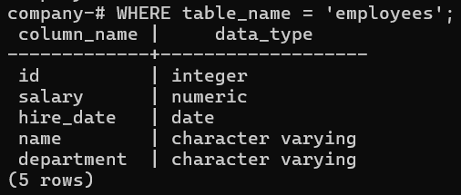
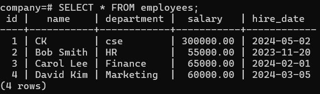

# Overview

- [Overview](#overview)
- [View Table Structure](#view-table-structure)
- [Table Data](#table-data)

&nbsp;

&nbsp;

&nbsp;

# View Table Structure

```sql
SELECT column_name, data_type
FROM information_schema.columns
WHERE table_name = 'employees';
&nbsp;
```



&nbsp;

&nbsp;

# Table Data

```sql
SELECT * FROM employees;
```



&nbsp;

&nbsp;

&nbsp;

&nbsp;

&nbsp;

&nbsp;

&nbsp;

&nbsp;

&nbsp;

&nbsp;

&nbsp;
