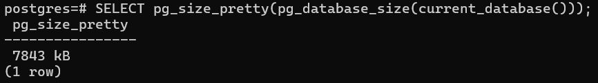
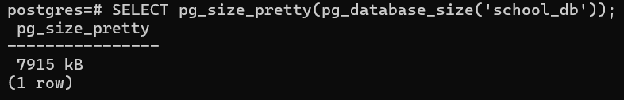

# Overview

- [Overview](#overview)
- [Size of the current database](#size-of-the-current-database)
- [Size of a specific database](#size-of-a-specific-database)

&nbsp;

&nbsp;

&nbsp;

# Size of the current database

```sql
SELECT pg_size_pretty(pg_database_size(current_database()));
```



&nbsp;

&nbsp;

# Size of a specific database

```sql
SELECT pg_size_pretty(pg_database_size('your_database_name'));
```


