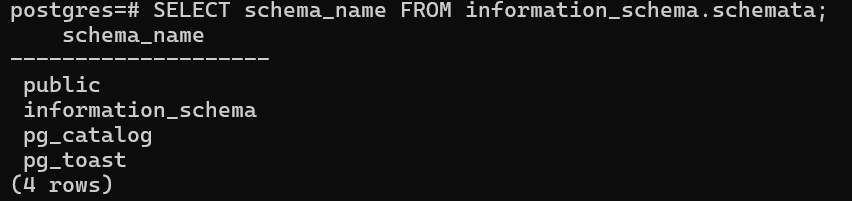
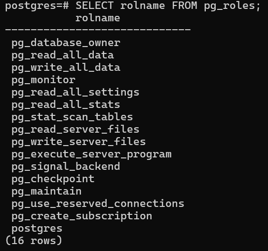
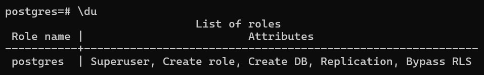

# Overview

- [Overview](#overview)
- [List all schemas in current database](#list-all-schemas-in-current-database)
- [List all tables in the public schema](#list-all-tables-in-the-public-schema)
- [List all Roles in the database](#list-all-roles-in-the-database)

&nbsp;

&nbsp;

&nbsp;

# List all schemas in current database

```sql
SELECT schema_name FROM information_schema.schemata;
```



&nbsp;

&nbsp;

# List all tables in the public schema

```sql
SELECT table_name FROM information_schema.tables WHERE table_schema = 'public';
```


&nbsp;

&nbsp;

# List all Roles in the database

```sql
SELECT rolname FROM pg_roles;
```



&nbsp;

We can also use `\du` to check list of roles with attributes.

This doesn't work in pgadmin.

&nbsp;

```sql
\du
```



&nbsp;

&nbsp;

&nbsp;
