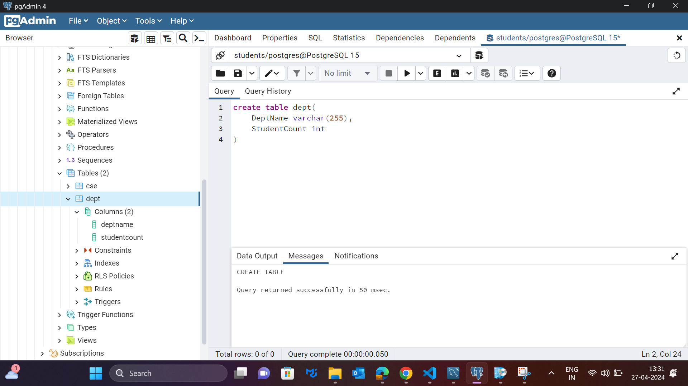
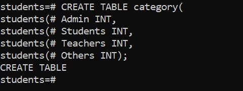
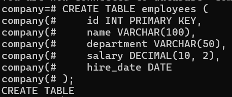
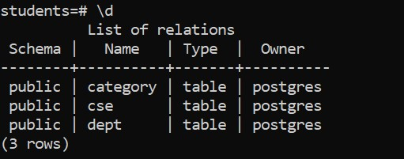
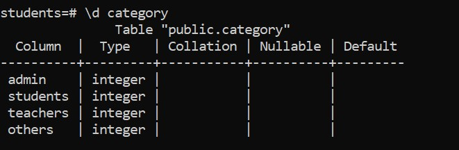

# Overview

- [Overview](#overview)
- [Table](#table)
- [Create a table](#create-a-table)
  - [Syntax](#syntax)
  - [Example 1](#example-1)
  - [Example 2](#example-2)
    - [Explanation](#explanation)
- [Display all tables](#display-all-tables)
  - [Syntax](#syntax-1)
  - [Syntax](#syntax-2)

&nbsp;

&nbsp;

&nbsp;

# Table

A table is a database object that stores data in rows and columns.

&nbsp;

&nbsp;

# Create a table

## Syntax

```sql
CREATE TABLE table_name(
    column_name1 datatype,
    column_name2 datatype,
    column_name3 datatype,
    .
    .
);
```

&nbsp;

&nbsp;

## Example 1

```sql
CREATE TABLE dept(
    DeptName VARCHAR(255),
    StudentCount int
);
```

&nbsp;



&nbsp;



&nbsp;

&nbsp;

## Example 2

```sql
CREATE TABLE employees (
    id INT PRIMARY KEY,
    name VARCHAR(100),
    department VARCHAR(50),
    salary DECIMAL(10, 2),
    hire_date DATE
);
```



&nbsp;

### Explanation

| Column       | Data Type     | Description                         |
| ------------ | ------------- | ----------------------------------- |
| `id`         | INT           | Unique identifier for each employee |
| `name`       | VARCHAR(100)  | String with max length 100          |
| `department` | VARCHAR(50)   | Employee's department               |
| `salary`     | DECIMAL(10,2) | Salary (precision 10, scale 2)      |
| `hire_date`  | DATE          | Date the employee was hired         |
|              |               |                                     |

&nbsp;

&nbsp;

# Display all tables

To display all tables in the database we use `\d` or `\dt`

&nbsp;

## Syntax

```sql
\d
-- or
\dt
```



&nbsp;

&nbsp;

To see the details of particular table in the database we use `\d table_name`

&nbsp;

## Syntax

```sql
\d table_name
```



&nbsp;

This shows:

- Columns with data types
- Indexes
- Constraints (primary key, foreign key)
- Triggers, if any

&nbsp;
