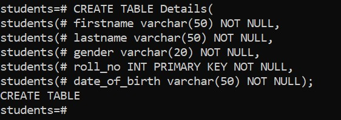

# Overview

- [Overview](#overview)
- [Constraints](#constraints)
- [List of Constraints in PostgreSQL](#list-of-constraints-in-postgresql)
- [Table with Constraints](#table-with-constraints)
  - [Syntax](#syntax)
  - [Example](#example)
- [Constraints Details and Examples](#constraints-details-and-examples)
  - [1. PRIMARY KEY](#1-primary-key)
  - [2. FOREIGN KEY](#2-foreign-key)
  - [3. UNIQUE](#3-unique)
  - [4. NOT NULL](#4-not-null)
  - [5. CHECK](#5-check)
  - [6. DEFAULT](#6-default)
  - [7. EXCLUSION (Advanced)](#7-exclusion-advanced)
- [Tips to View Constraints on a Table](#tips-to-view-constraints-on-a-table)

&nbsp;

&nbsp;

&nbsp;

# Constraints

In PostgreSQL, constraints are rules enforced on data in tables to maintain accuracy and integrity.

&nbsp;

&nbsp;

# List of Constraints in PostgreSQL

| Constraint Type | Description                                                                                                 |
| --------------- | ----------------------------------------------------------------------------------------------------------- |
| **PRIMARY KEY** | Uniquely identifies each row. Cannot be NULL.                                                               |
| **FOREIGN KEY** | Ensures referential integrity by enforcing that a value in one table matches a value in another.            |
| **UNIQUE**      | Ensures all values in a column (or group of columns) are different.                                         |
| **NOT NULL**    | Ensures a column cannot have NULL values.                                                                   |
| **CHECK**       | Ensures the value in a column meets a specific condition.                                                   |
| **DEFAULT**     | Provides a default value for a column when none is specified.                                               |
| **EXCLUSION**   | Prevents a combination of column values from appearing more than once using operators. (Advanced use cases) |

&nbsp;

&nbsp;

# Table with Constraints

## Syntax

```sql
CREATE TABLE table_name (
    column1 datatype constraint,
    column2 datatype constraint,
    column3 datatype constraint,
    ....
);
```

&nbsp;

## Example

```sql
CREATE TABLE Details(
    firstname varchar(50) NOT NULL,
    lastname varchar(50) NOT NULL,
    gender varchar(20) NOT NULL,
    roll_no INT PRIMARY KEY NOT NULL,
    date_of_birth varchar(50) NOT NULL
);
```

&nbsp;



&nbsp;

&nbsp;

# Constraints Details and Examples

## 1. PRIMARY KEY

```sql
CREATE TABLE employees (
  emp_id SERIAL PRIMARY KEY,
  name TEXT NOT NULL
);
```

&nbsp;

&nbsp;

## 2. FOREIGN KEY

```sql
CREATE TABLE orders (
  order_id SERIAL PRIMARY KEY,
  emp_id INT REFERENCES employees(emp_id)
);
```

&nbsp;

You can also explicitly declare it:

```sql
CONSTRAINT fk_emp FOREIGN KEY (emp_id) REFERENCES employees(emp_id)
```

&nbsp;

&nbsp;

## 3. UNIQUE

```sql
Copy code
CREATE TABLE users (
  user_id SERIAL PRIMARY KEY,
  email TEXT UNIQUE
);
```

&nbsp;

&nbsp;

## 4. NOT NULL

```sql
CREATE TABLE products (
  product_id SERIAL PRIMARY KEY,
  product_name TEXT NOT NULL
);
```

&nbsp;

&nbsp;

## 5. CHECK

```sql
CREATE TABLE accounts (
  account_id SERIAL PRIMARY KEY,
  balance NUMERIC CHECK (balance >= 0)
);
```

&nbsp;

&nbsp;

## 6. DEFAULT

```sql
CREATE TABLE messages (
  message_id SERIAL PRIMARY KEY,
  created_at TIMESTAMP DEFAULT CURRENT_TIMESTAMP
);
```

&nbsp;

&nbsp;

## 7. EXCLUSION (Advanced)

```sql
CREATE TABLE appointments (
  room_id INT,
  during TSRANGE,
  EXCLUDE USING gist (room_id WITH =, during WITH &&)
);
```

Prevents overlapping appointments in the same room.
&nbsp;

&nbsp;

# Tips to View Constraints on a Table

In psql:

```bash
\d table_name
```

&nbsp;

&nbsp;
Query from system catalogs:

```sql
SELECT conname AS constraint_name, contype AS constraint_type
FROM pg_constraint
WHERE conrelid = 'your_table_name'::regclass;
```

&nbsp;

&nbsp;

&nbsp;
