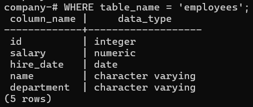
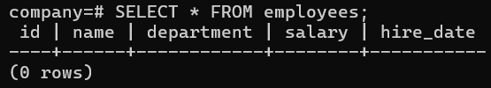
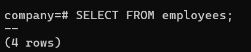

# Overview

- [Overview](#overview)
- [View Table Structure](#view-table-structure)
  - [Syntax](#syntax)
  - [Example](#example)
- [Table Data](#table-data)
  - [Syntax](#syntax-1)
  - [Example](#example-1)
- [No of rows in a Table](#no-of-rows-in-a-table)
  - [Syntax](#syntax-2)
  - [Example](#example-2)

&nbsp;

&nbsp;

&nbsp;

# View Table Structure

## Syntax

```sql
SELECT column_name, data_type, is_nullable, column_default
FROM information_schema.columns
WHERE table_name = 'your_table_name'
ORDER BY ordinal_position;
```

&nbsp;

&nbsp;

## Example

```sql
SELECT column_name, data_type, is_nullable, column_default
FROM information_schema.columns
WHERE table_name = 'employees';
```

&nbsp;



&nbsp;

&nbsp;

# Table Data

## Syntax

```sql
SELECT * FROM table_name;
```

&nbsp;

&nbsp;

## Example

```sql
SELECT * FROM employees;
```



&nbsp;

&nbsp;

# No of rows in a Table

## Syntax

```sql
SELECT FROM table_name;
```

&nbsp;

&nbsp;

## Example

```sql
SELECT FROM employees;
```



&nbsp;

&nbsp;

&nbsp;

&nbsp;

&nbsp;

&nbsp;

&nbsp;

&nbsp;

&nbsp;
