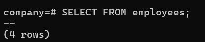
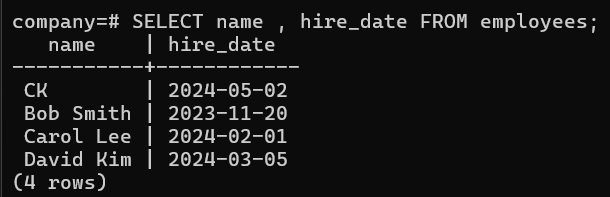

# Overview

- [Overview](#overview)
- [Insert a Row into table](#insert-a-row-into-table)
  - [Syntax](#syntax)
  - [Example](#example)
- [Insert multiple Rows into table](#insert-multiple-rows-into-table)
  - [Syntax](#syntax-1)
  - [Example](#example-1)
- [View Inserted Data](#view-inserted-data)
  - [Syntax](#syntax-2)
  - [Example](#example-2)
- [No of rows in a Table](#no-of-rows-in-a-table)
  - [Syntax](#syntax-3)
  - [Example](#example-3)
- [See particular column in a Table](#see-particular-column-in-a-table)
  - [Syntax](#syntax-4)
  - [Example](#example-4)

&nbsp;

&nbsp;

&nbsp;

# Insert a Row into table

## Syntax

```
INSERT INTO table_name (column1, column2, ...)
VALUES (value1, value2, ...);
```

&nbsp;

## Example

```sql
INSERT INTO employees ( id,name, department, salary, hire_date) values (1,'CK','cse',300000,'02-05-2024');
```


&nbsp;

&nbsp;

# Insert multiple Rows into table

## Syntax

```
INSERT INTO table_name (column1, column2, ...)
VALUES (value1, value2, ...),
(value1, value2, ...),
(value1, value2, ...)....;
```

&nbsp;

## Example

```sql
INSERT INTO employees (id, name, department, salary, hire_date)
 Values (2, 'Bob Smith', 'HR', 55000.00, '2023-11-20'),
 (3, 'Carol Lee', 'Finance', 65000.00, '2024-02-01'),
 (4, 'David Kim', 'Marketing', 60000.00, '2024-03-05');
```


&nbsp;

&nbsp;

# View Inserted Data

## Syntax

```sql
SELECT * FROM table_name;
```

&nbsp;

&nbsp;

## Example

```sql
SELECT * FROM employees;
```


&nbsp;

&nbsp;

# No of rows in a Table

## Syntax

```sql
SELECT FROM table_name;
```

&nbsp;

## Example

```sql
SELECT FROM employees;
```



&nbsp;

&nbsp;

# See particular column in a Table

## Syntax

```sql
SELECT column_name1, column_name2,..  FROM table_name;
```

&nbsp;

## Example

```sql
SELECT name, hire_date FROM employees;
```



&nbsp;
