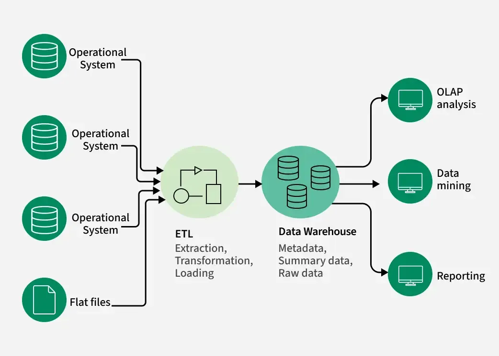

# Content

- [Content](#content)
- [Modern Data Warehouse Architecture (ELT + DBT)](#modern-data-warehouse-architecture-elt--dbt)
- [Explanation](#explanation)
  - [Step 1: Source Systems](#step-1-source-systems)
  - [Step 2: Extract (E)](#step-2-extract-e)
    - [Example](#example)
  - [Step 3: Load (L)](#step-3-load-l)
    - [Example:](#example-1)
  - [Step 4: Transform Using DBT (T)](#step-4-transform-using-dbt-t)
    - [Layer 1: Staging Models](#layer-1-staging-models)
      - [Purpose:](#purpose)
    - [Layer 2: Intermediate Models](#layer-2-intermediate-models)
      - [Purpose:](#purpose-1)
    - [Layer 3: Mart Models](#layer-3-mart-models)
      - [Dimension Table](#dimension-table)
      - [Fact Table](#fact-table)
    - [Star Schema](#star-schema)
      - [Fact Table](#fact-table-1)
      - [Dimension Tables](#dimension-tables)
  - [Step 5: Reporting](#step-5-reporting)
- [End-to-End Flow for ETL](#end-to-end-flow-for-etl)

&nbsp;

&nbsp;

&nbsp;

# Modern Data Warehouse Architecture (ELT + DBT)

In a modern ELT architecture, data is extracted from source systems and loaded directly into the Snowflake Data Warehouse. DBT performs transformations inside Snowflake by creating staging, intermediate, and mart models. The final mart layer contains fact and dimension tables organized in a star schema. BI tools such as Power BI or Tableau connect to these tables for reporting and analytics. Snowflake acts as the centralized Data Warehouse, while DBT handles data transformation and modeling.

&nbsp;

&nbsp;

```
+----------------------+
|   Source Systems     |
+----------------------+
| Website              |
| CRM                  |
| ERP                  |
| APIs                 |
+----------+-----------+
           |
           | Extract
           v
+----------------------+
| EL Tool              |
+----------------------+
| Airbyte              |
| Fivetran             |
| Python               |
+----------+-----------+
           |
           | Load
           v
+------------------------------------------------------+
|                 DATA WAREHOUSE                       |
|                    Snowflake                         |
|                                                      |
|  RAW LAYER                                           |
|  --------------------------------------------------  |
|  orders_raw                                          |
|  customers_raw                                       |
|  products_raw                                        |
|                                                      |
|                 DBT Transformations                  |
|                                                      |
|  STAGING LAYER                                       |
|  --------------------------------------------------  |
|  stg_orders                                          |
|  stg_customers                                       |
|  stg_products                                        |
|                                                      |
|                 DBT Transformations                  |
|                                                      |
|  INTEGRATION LAYER                                   |
|  --------------------------------------------------  |
|  int_customer_orders                                 |
|  int_sales_metrics                                   |
|  int_product_performance                             |
|                                                      |
|                 DBT Transformations                  |
|                                                      |
|  PRESENTATION / MART LAYER                           |
|  --------------------------------------------------  |
|  fact_sales                                          |
|  dim_customer                                        |
|  dim_product                                         |
|  dim_date                                            |
|  sales_dashboard_mart                                |
+------------------------------------------------------+
           |
           v
+----------------------+
| BI / Reporting       |
+----------------------+
| Power BI             |
| Tableau              |
+----------------------+
```

&nbsp;

&nbsp;

# Explanation

## Step 1: Source Systems

These are applications where data is generated.

&nbsp;

Website Orders

| Order_ID | Customer_ID | Amount |
| -------- | ----------- | ------ |
| 101      | 1           | 500    |
| 102      | 2           | 700    |

&nbsp;

CRM Customers

| Customer_ID | Name  |
| ----------- | ----- |
| 1           | John  |
| 2           | Alice |

At this stage data is spread across multiple systems.

&nbsp;

&nbsp;

## Step 2: Extract (E)

We pull data from source systems.

&nbsp;

### Example

```
Website Database
CRM
ERP
     |
     v
Extract Data
```

&nbsp;

Tools:

- Airbyte
- Fivetran
- Informatica
- Python Scripts

Nothing is modified yet.

We simply copy the data.

&nbsp;

&nbsp;

## Step 3: Load (L)

Now we load the extracted data directly into Snowflake.

Raw Layer

```
Snowflake
|
+-- RAW
    |
    +-- orders_raw
    +-- customers_raw
    +-- products_raw
```

&nbsp;

### Example

orders_raw

| order_id | cust_id | amt |
| -------- | ------- | --- |
| 101      | 1       | 500 |

&nbsp;

Data may be:

- Dirty
- Duplicated
- Inconsistent

That's okay.

We load first.

&nbsp;

&nbsp;

## Step 4: Transform Using DBT (T)

After loading data into Snowflake, DBT starts transforming it.

DBT uses SQL to create clean business-ready tables.

&nbsp;

### Layer 1: Staging Models

Raw data:

| cust_id | customer_name |
| ------- | ------------- |
| 1       | john          |
| 2       | ALICE         |

&nbsp;

DBT model:

```sql
select
    cust_id as customer_id,
    initcap(customer_name) as customer_name
from customers_raw
```

&nbsp;

Output:

stg_customers

| customer_id | customer_name |
| ----------- | ------------- |
| 1           | John          |
| 2           | Alice         |

&nbsp;

#### Purpose

- Rename columns
- Standardize formats
- Basic cleaning

&nbsp;

&nbsp;

### Layer 2: Intermediate Models

Combine datasets.

```sql
select
    o.order_id,
    c.customer_name,
    o.amount
from stg_orders o
join stg_customers c
on o.customer_id = c.customer_id
```

&nbsp;

#### Purpose

- Joins
- Business calculations
- Reusable logic

&nbsp;

&nbsp;

### Layer 3: Mart Models

This is the final layer used by business users.

#### Dimension Table

dim_customer

| customer_id | customer_name |
| ----------- | ------------- |
| 1           | John          |
| 2           | Alice         |

&nbsp;

#### Fact Table

fact_sales

| order_id | customer_id | amount |
| -------- | ----------- | ------ |
| 101      | 1           | 500    |

&nbsp;

&nbsp;

### Star Schema

The Mart layer is usually designed as a Star Schema.

```
                 dim_customer
                       |
                       |
dim_product ---- fact_sales ---- dim_date
                       |
                       |
                 dim_store
```

&nbsp;

#### Fact Table

Stores measurable business events.

Examples:

- Sales
- Orders
- Transactions

&nbsp;

#### Dimension Tables

Provide descriptive information.

Examples:

- Customer
- Product
- Date
- Store

&nbsp;

&nbsp;

## Step 5: Reporting

Power BI connects to the Mart layer.

```
Power BI
    |
    v
fact_sales
dim_customer
dim_product
```

&nbsp;

Business users create:

- Revenue Dashboards
- Sales Reports
- Customer Analysis
- Product Performance Reports

&nbsp;

&nbsp;

&nbsp;

# End-to-End Flow for ETL



&nbsp;

&nbsp;

&nbsp;

&nbsp;

&nbsp;

&nbsp;

&nbsp;

&nbsp;

&nbsp;

&nbsp;

&nbsp;

&nbsp;

&nbsp;

&nbsp;

&nbsp;

&nbsp;

&nbsp;

&nbsp;

&nbsp;

&nbsp;

&nbsp;

&nbsp;

&nbsp;

&nbsp;

&nbsp;

&nbsp;

&nbsp;

&nbsp;

&nbsp;
