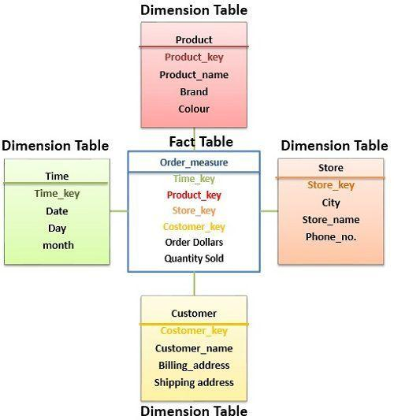

# Content

- [Content](#content)
- [Schema design](#schema-design)
- [Types of Schema design](#types-of-schema-design)
- [Star Schema ⭐](#star-schema-)
- [Structure](#structure)
- [Components](#components)
  - [Fact Table (Measures / Metrics)](#fact-table-measures--metrics)
  - [Dimension Tables (Descriptions)](#dimension-tables-descriptions)
- [Why Star Schema is Popular](#why-star-schema-is-popular)
  - [Advantages](#advantages)
  - [Disadvantages](#disadvantages)
- [How Query Works](#how-query-works)
  - [Flow](#flow)
- [Real Example in Data Engineering (Snowflake + dbt)](#real-example-in-data-engineering-snowflake--dbt)
  - [In dbt](#in-dbt)
    - [Example](#example)

&nbsp;

&nbsp;

&nbsp;

# Schema design

Schema design is a fundamental concept in Data Warehousing. It defines how data is organized for analytical reporting and querying.

&nbsp;

&nbsp;

# Types of Schema design

There are **two** types of schema design models.

- Star Schema
- Snowflake Schema

&nbsp;

&nbsp;

# Star Schema ⭐

A Star Schema is a data warehouse design pattern where one central Fact Table connects directly to multiple Dimension Tables.

It is called a star because the tables form a star-like shape.

&nbsp;

The structure looks like a star:

- One central Fact Table
- Multiple surrounding Dimension Tables

&nbsp;



&nbsp;

&nbsp;

# Structure

```
             DIM_CUSTOMER
                  |
DIM_PRODUCT — FACT_SALES — DIM_DATE
                  |
            DIM_LOCATION
```

The Fact Table is at the center and dimensions surround it.

&nbsp;

&nbsp;

# Components

## Fact Table (Measures / Metrics)

Stores numeric business events.

Example: `FACT_SALES`

| Order_ID | Product_ID | Customer_ID | Date_ID | Revenue |
| -------- | ---------- | ----------- | ------- | ------- |
| 1001     | P01        | C01         | D01     | 500     |

&nbsp;

Contains:

- Foreign Keys : link to dimensions
- Measures/ Metrics:
  - Sales
  - Revenue
  - Quantity
  - Profit

&nbsp;

## Dimension Tables (Descriptions)

Store descriptive information.

Example: `DIM_PRODUCT`

| Product_ID | Product_Name | Category    |
| ---------- | ------------ | ----------- |
| P01        | Laptop       | Electronics |

&nbsp;

&nbsp;

# Why Star Schema is Popular

## Advantages

- ✅ Fast analytical queries
- ✅ Easy to understand
- ✅ Works well with BI tools
- ✅ Fewer joins

&nbsp;

## Disadvantages

- ❌ Duplicate data in dimensions
- ❌ Uses more storage than normalized designs

&nbsp;

&nbsp;

# How Query Works

Question:

> “Total revenue by product category?”

&nbsp;

```sql
SELECT
    p.category,
    SUM(f.revenue) AS total_sales
FROM FACT_SALES f
JOIN DIM_PRODUCT p
ON f.product_id = p.product_id
GROUP BY p.category;
```

&nbsp;

## Flow

```
FACT_SALES
    ↓
Join DIM_PRODUCT
    ↓
Aggregate Revenue
    ↓
Business Insight
```

&nbsp;

&nbsp;

# Real Example in Data Engineering (Snowflake + dbt)

Suppose you're building an online shopping warehouse:

```
FACT_ORDERS
├── DIM_CUSTOMER
├── DIM_PRODUCT
├── DIM_DATE
├── DIM_REGION
└── DIM_PAYMENT
```

&nbsp;

## In dbt

```
stg_* → staging models
dim_* → dimension models
fct_* → fact models
```

&nbsp;

### Example

```
models/
 ├── staging/
 ├── marts/
      ├── dimensions/
      │     ├── dim_customer.sql
      │     └── dim_product.sql
      └── facts/
            └── fct_orders.sql
```

&nbsp;

&nbsp;
