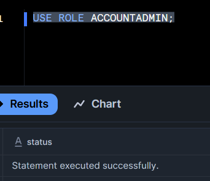

# Overview

- [Overview](#overview)
- [Use role](#use-role)
- [Create Database](#create-database)
- [Create Schema](#create-schema)
- [Create Warehouse with mentioned size](#create-warehouse-with-mentioned-size)

&nbsp;

&nbsp;

&nbsp;

# Use role

> USE ROLE ACCOUNTADMIN;

&nbsp;

&nbsp;

&nbsp;

# Create Database

> CREATE DATABASE DEMO;

&nbsp;

# Create Schema

CREATE SCHEMA DEMO_SCHEMA;

&nbsp;

# Create Warehouse with mentioned size

CREATE WAREHOUSE my_largewh WAREHOUSE_SIZE = 'X-LARGE';

&nbsp;

&nbsp;

&nbsp;

&nbsp;

&nbsp;

&nbsp;
