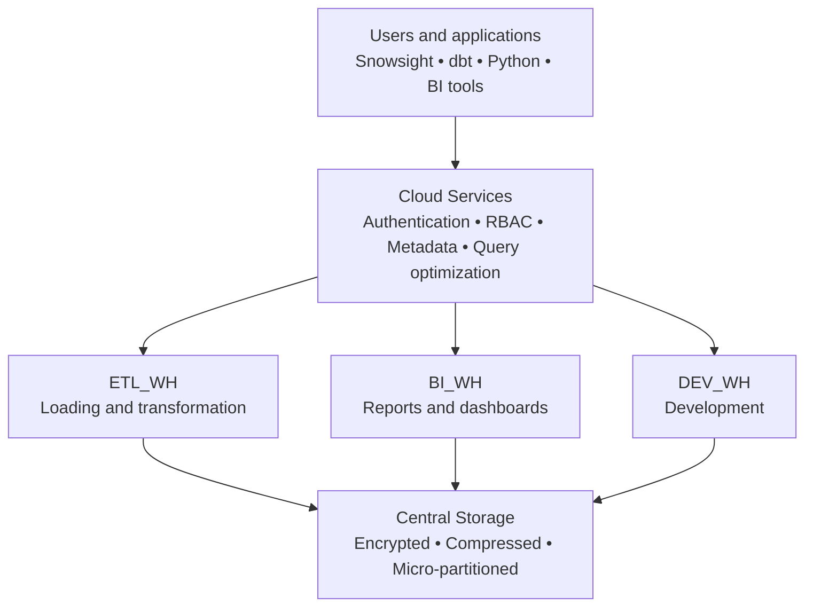

# Snowflake Architecture



&nbsp;

```
                +----------------------+
                |   Cloud Services     |
                | Metadata, Security   |
                +----------+-----------+
                           |
      ------------------------------------------
      |                                        |
      v                                        v

+-------------------+              +-------------------+
| Virtual Warehouse |              | Virtual Warehouse |
| (Compute)         |              | (Compute)         |
| BI Queries        |              | ELT / DBT Jobs    |
+---------+---------+              +---------+---------+
          \                                 /
           \                               /
            v                             v

      +--------------------------------------+
      |      Centralized Data Storage        |
      | Tables, Files, Historical Data       |
      +--------------------------------------+
```

&nbsp;

&nbsp;
