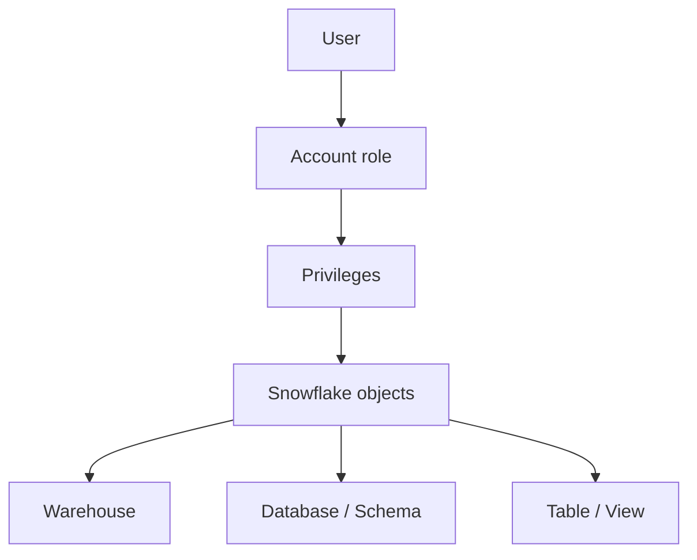

# Content

- [Content](#content)
- [RBAC](#rbac)
- [Main RBAC components](#main-rbac-components)
- [Access flow](#access-flow)
  - [Example:](#example)
- [RBAC Best Practices](#rbac-best-practices)

&nbsp;

&nbsp;

&nbsp;

# RBAC

RBAC stands for Role-Based Access Control.

It controls what users can do by assigning privileges to roles and then assigning those roles to users.

&nbsp;

The main principle is:

> Privileges are granted to roles, and roles are granted to users.

&nbsp;

&nbsp;



&nbsp;

&nbsp;

# Main RBAC components

| Component        | Purpose                                              | Example                                  |
| ---------------- | ---------------------------------------------------- | ---------------------------------------- |
| User             | Person or service accessing Snowflake                | `CHAITALY_USER`                          |
| Role             | Collection of privileges                             | `DATA_ANALYST_ROLE`                      |
| Privilege        | Permission to perform an action                      | `SELECT`, `INSERT`, `USAGE`              |
| Securable object | Resource being protected                             | Warehouse, database, schema, table       |
| Role hierarchy   | Allows one role to inherit another role’s privileges | `SYSADMIN` inherits `DATA_ENGINEER_ROLE` |

&nbsp;

&nbsp;

# Access flow

```md
USER → ROLE → PRIVILEGE → OBJECT
```

&nbsp;

## Example:

```md
CHAITALY_USER
↓
DATA_ANALYST_ROLE
↓
USAGE + SELECT
↓
ANALYTICS_DB.PUBLIC.EMPLOYEES
```

The user does not require privileges to be granted individually. The user inherits them from the role.

&nbsp;

&nbsp;

&nbsp;

# RBAC Best Practices

- Grant privileges to roles, not directly to users.
- Apply least privilege.
- Connect custom account roles to `SYSADMIN`.
- Avoid using `ACCOUNTADMIN` for routine work.
- Use `SECURITYADMIN` for centralized grant management.
- Avoid granting business access through `PUBLIC`.
- Separate access roles from functional roles.
- Separate read, write, operate and ownership responsibilities.
- Use future grants for newly created objects.
- Grant custom roles into a controlled hierarchy.
- Grant roles—not individual privileges—to users whenever practical.
- Use managed access schemas when grants must be centrally controlled.
- Regularly review role assignments and privileges.

&nbsp;

&nbsp;

&nbsp;

&nbsp;

&nbsp;

&nbsp;

&nbsp;

&nbsp;

&nbsp;

&nbsp;

&nbsp;
