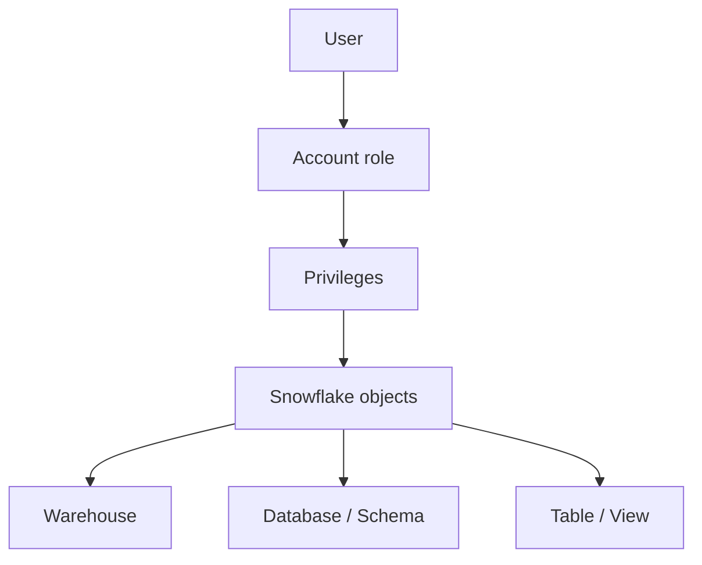

# Content

- [Content](#content)
- [RBAC](#rbac)
- [Main RBAC components](#main-rbac-components)
- [Access flow](#access-flow)
  - [Example:](#example)
- [RBAC Best Practices](#rbac-best-practices)

&nbsp;

&nbsp;

&nbsp;

# RBAC

RBAC = Role-Based Access Control.

Snowflake uses RBAC to control who can access which objects and what operations they can perform.

&nbsp;

The main principle is:

> Privileges are granted to roles → Roles are granted to users → Users access objects through roles.

&nbsp;

&nbsp;



&nbsp;

&nbsp;


# Why RBAC?

RBAC provides:

- Centralized access management
- Least-privilege security
- Easier onboarding/offboarding
- Separation of duties
- Scalable permission management
- Better auditing and governance


&nbsp;

&nbsp;


# Main RBAC components

| Component        | Purpose                                              | Example                                  |
| ---------------- | ---------------------------------------------------- | ---------------------------------------- |
| User             | Person or service accessing Snowflake                | `CHAITALY_USER`                          |
| Role             | Collection of privileges                             | `DATA_ANALYST_ROLE`                      |
| Privilege        | Permission to perform an action                      | `SELECT`, `INSERT`, `USAGE`              |
| Securable object | Resource being protected                             | Warehouse, database, schema, table       |
| Role hierarchy   | Allows one role to inherit another role’s privileges | `SYSADMIN` inherits `DATA_ENGINEER_ROLE` |
| Ownership        | Gives control over an object                         | `OWNERSHIP ON TABLE`                     |

&nbsp;

&nbsp;

# Access flow

```md
USER → ROLE → PRIVILEGE → OBJECT
```

&nbsp;

## Example:

Suppose we have:

```md
CHAITALY_USER
↓
DATA_ANALYST_ROLE
↓
USAGE + SELECT
↓
ANALYTICS_DB.PUBLIC.EMPLOYEES
```

&nbsp;

We could configure it as:

```sql
CREATE ROLE DATA_ANALYST_ROLE;

GRANT SELECT
ON TABLE EMP_DB.ANALYTICS.EMPLOYEE
TO ROLE DATA_ANALYST_ROLE;

GRANT ROLE DATA_ANALYST_ROLE
TO USER USER1;
```

The user does not require privileges to be granted individually. The user inherits them from the role.

&nbsp;

Now USER1 can use the role:

```sql
USE ROLE DATA_ANALYST_ROLE;
```

&nbsp;

&nbsp;

But there is an important issue with the example above.

`SELECT` on the **table** alone isn't sufficient. The role also normally needs `USAGE` on the **parent database and schema**, and a query requires an appropriate **warehouse**.

A more realistic configuration is:

```sql
GRANT USAGE
ON DATABASE EMP_DB
TO ROLE DATA_ANALYST_ROLE;

GRANT USAGE
ON SCHEMA EMP_DB.ANALYTICS
TO ROLE DATA_ANALYST_ROLE;

GRANT SELECT
ON TABLE EMP_DB.ANALYTICS.EMPLOYEE
TO ROLE DATA_ANALYST_ROLE;

GRANT USAGE
ON WAREHOUSE ANALYTICS_WH
TO ROLE DATA_ANALYST_ROLE;
```

&nbsp;

&nbsp;

Snowflake combines both:

```sql
DAC: Role owns the table
              ↓
RBAC: Owner grants SELECT to another role
              ↓
User receives that role
```

&nbsp;

&nbsp;

&nbsp;

&nbsp;

&nbsp;

&nbsp;

# RBAC Best Practices

- Grant privileges to roles, not directly to users.
- Apply least privilege.
- Connect custom account roles to `SYSADMIN`.
- Avoid using `ACCOUNTADMIN` for routine work.
- Use `SECURITYADMIN` for centralized grant management.
- Avoid granting business access through `PUBLIC`.
- Separate access roles from functional roles.
- Separate read, write, operate and ownership responsibilities.
- Use future grants for newly created objects.
- Grant custom roles into a controlled hierarchy.
- Grant roles—not individual privileges—to users whenever practical.
- Use managed access schemas when grants must be centrally controlled.
- Regularly review role assignments and privileges.

&nbsp;

&nbsp;

&nbsp;

&nbsp;

&nbsp;

&nbsp;

&nbsp;

&nbsp;

&nbsp;

&nbsp;

&nbsp;
