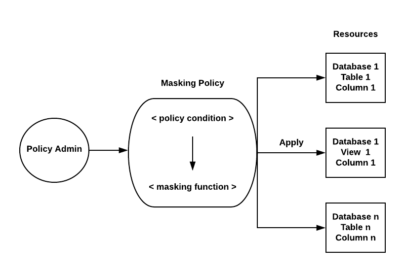

# Overview

- [Overview](#overview)
- [Masking Policy](#masking-policy)
- [Simple Example](#simple-example)
- [How it Works](#how-it-works)
- [Syntax](#syntax)
- [Example](#example)
- [Key Concepts](#key-concepts)
- [🎯 Real Use Cases](#-real-use-cases)
- [Masking Policy vs Row Access Policy](#masking-policy-vs-row-access-policy)

&nbsp;

&nbsp;

&nbsp;

# Masking Policy

A Masking Policy in Snowflake is a data security feature used to **hide or baffle sensitive data** (like emails, phone numbers, salaries, etc.) from unauthorized users—while still allowing access to the table.

&nbsp;

Masking policy are **schema level** object

Masking Policy can include conditions and functions to transform the data when those conditions are met.

Same masking policy can be applied on multiple column.

&nbsp;

&nbsp;

&nbsp;

A Masking Policy dynamically transforms column data based on who is querying it.

👉 That means:

- Authorized users → see actual data
- Unauthorized users → see masked (hidden or altered) data

&nbsp;

&nbsp;

# Simple Example

| NAME | EMAIL            |
| ---- | ---------------- |
| John | `john@gmail.com` |

&nbsp;

With masking:

- Admin → `john@gmail.com`
- Analyst → `j***@gmail.com` or `NULL`

&nbsp;

&nbsp;

# How it Works

Masking policies use:

- Roles (RBAC)
- Conditions
- SQL expressions

&nbsp;

&nbsp;

# Syntax

```sql
CREATE MASKING POLICY policy_name AS replaced_name RETURNS return_value CASE condition
END;
```

&nbsp;

&nbsp;

# Example

```sql
CREATE MASKING POLICY email_mask AS (val STRING)
RETURNS STRING ->
CASE
    WHEN CURRENT_ROLE() IN ('ADMIN_ROLE') THEN val
    ELSE '****@masked.com'
END;
```

&nbsp;

Apply it to a column:

```sql
ALTER TABLE users
ALTER COLUMN email
SET MASKING POLICY email_mask;
```

&nbsp;

&nbsp;



&nbsp;

&nbsp;

# Key Concepts

1. <u>**_Dynamic Data Masking_**</u>: Data is masked at query time
   Original data remains unchanged

2. <u>**_Role-Based Access_**</u>: Uses `CURRENT_ROLE()` to decide visibility

3. <u>**_Column-Level Security_**</u>: Applied to specific columns only

4. <u>**_Reusability_**</u>: One policy can be reused across multiple tables

&nbsp;

&nbsp;

# 🎯 Real Use Cases

- Hide PII (Personally Identifiable Information)
- Protect financial data (salary, bank details)
- Mask customer data in analytics dashboards
- Enable safe data sharing

&nbsp;

&nbsp;

&nbsp;

# Masking Policy vs Row Access Policy

| Feature | Masking Policy | Row Access Policy             |
| ------- | -------------- | ----------------------------- |
| Level   | Column         | Row                           |
| Purpose | Hide data      | Filter rows                   |
| Example | Mask email     | Show only own department data |
|         |                |                               |

&nbsp;

&nbsp;

&nbsp;

&nbsp;

&nbsp;

&nbsp;

&nbsp;

&nbsp;

&nbsp;

&nbsp;

&nbsp;

&nbsp;
