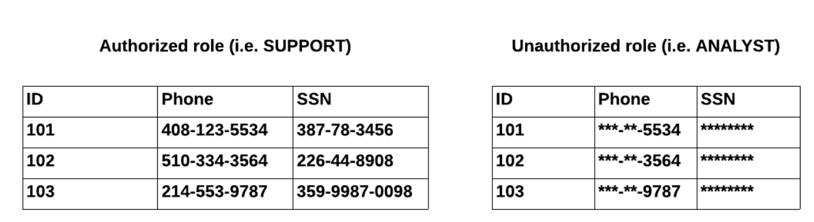

# Overview

- [Overview](#overview)
- [Dynamic Data Masking](#dynamic-data-masking)

&nbsp;

&nbsp;

&nbsp;

# Dynamic Data Masking

Sensitive data in snowflake is not modified in an existing table. But when the users execute a query, it will apply the masking dynamically and displays the data, hence called dynamic table.

&nbsp;

The data can be masked, partially masked, unclear, or tokenized data.

&nbsp;

Mostly masking policies applied based on snowflake roles.

&nbsp;

&nbsp;

&nbsp;

&nbsp;

&nbsp;

&nbsp;

&nbsp;

&nbsp;

&nbsp;

&nbsp;
