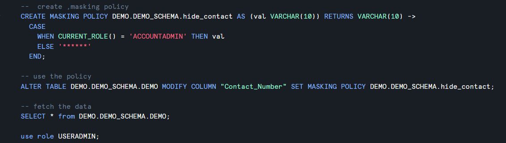

# Overview

- [Overview](#overview)
- [Create policy](#create-policy)
- [Syntax to Create Policy](#syntax-to-create-policy)
  - [Example](#example)
  - [Explanation](#explanation)
    - [1️⃣ `CREATE MASKING POLICY email_mask`](#1️⃣-create-masking-policy-email_mask)
    - [2️⃣ `AS (val STRING)`](#2️⃣-as-val-string)
      - [📌 Think](#-think)
    - [3️⃣ `RETURNS STRING`](#3️⃣-returns-string)
      - [📌 Here](#-here)
    - [4️⃣ `->`](#4️⃣--)
    - [5️⃣ CASE ... END](#5️⃣-case--end)
    - [🔍 Condition](#-condition)
      - [📌 Output](#-output)
      - [📌 Output](#-output-1)
- [Masking policy creation category](#masking-policy-creation-category)
- [1️⃣ Full Masking (Static Masking)](#1️⃣-full-masking-static-masking)
  - [Example](#example-1)
  - [📌 Output](#-output-2)
  - [✅ Use Case](#-use-case)
- [2️⃣ Partial Masking](#2️⃣-partial-masking)
  - [Example](#example-2)
  - [📌 Output](#-output-3)
  - [✅ Use Case](#-use-case-1)
- [3️⃣ Conditional Masking (Role-Based Masking)](#3️⃣-conditional-masking-role-based-masking)
  - [Example](#example-3)
  - [📌 Output](#-output-4)
  - [✅ Use Case](#-use-case-2)
- [4️⃣ Hash-Based Masking](#4️⃣-hash-based-masking)
  - [Example](#example-4)
  - [📌 Output](#-output-5)
  - [✅ Use Case](#-use-case-3)
- [5️⃣ Randomized / Tokenized Masking](#5️⃣-randomized--tokenized-masking)
  - [Example](#example-5)
  - [📌 Output](#-output-6)
  - [✅ Use Case](#-use-case-4)
- [6️⃣ NULL Masking](#6️⃣-null-masking)
  - [Example](#example-6)
  - [📌 Output](#-output-7)
  - [✅ Use Case](#-use-case-5)

&nbsp;

&nbsp;

&nbsp;

# Create policy

Masking policy can be created using **CREATE MASKING POLICY** command

&nbsp;

&nbsp;

# Syntax to Create Policy

```sql
create masking policy policy_name as (val datatype_of_column_value) returns datatype_of_output -> case condition
```

&nbsp;

&nbsp;

## Example

```sql
CREATE MASKING POLICY email_mask AS (val STRING)
RETURNS STRING ->
CASE
    WHEN CURRENT_ROLE() = 'ADMIN' THEN val
    ELSE '****@masked.com'
END;
```

&nbsp;



&nbsp;

&nbsp;

## Explanation

### 1️⃣ `CREATE MASKING POLICY email_mask`

👉 You are creating a masking policy named `email_mask`

- This is just the policy name
- You will attach it later to a column

&nbsp;

### 2️⃣ `AS (val STRING)`

👉 This defines the input parameter

- `val` → represents the column value
- `STRING` → data type of the column (e.g., email)

#### 📌 Think

- `val` = actual column data (like `john@gmail.com`)

&nbsp;

### 3️⃣ `RETURNS STRING`

👉 This defines the output type

- The policy must return the same data type as the column

#### 📌 Here

- Input = STRING
- Output = STRING ✔

&nbsp;

### 4️⃣ `->`

👉 This separates:

- Definition (above)
- Logic (below)

&nbsp;

### 5️⃣ CASE ... END

👉 This is the core masking logic

&nbsp;

### 🔍 Condition

`WHEN CURRENT_ROLE() = 'ADMIN' THEN val`

👉 If the user’s role is ADMIN:

- Show actual value
- No masking

#### 📌 Output

```md
john@gmail.com
```

&nbsp;

🔍 Else Condition:
`ELSE '****@masked.com'`

👉 For all other roles:

- Show masked value

#### 📌 Output

```sql
****@masked.com
```

&nbsp;

&nbsp;

# Masking policy creation category

| Type                | Behavior           | Example Use   |
| ------------------- | ------------------ | ------------- |
| Full Masking        | Completely hides   | Password      |
| Partial Masking     | Shows partial data | Phone         |
| Conditional Masking | Role-based access  | Salary        |
| Hash Masking        | Converts to hash   | Analytics     |
| Random Masking      | Fake/random data   | Testing       |
| NULL Masking        | Returns NULL       | Sensitive PII |
|                     |                    |               |

&nbsp;

&nbsp;

# 1️⃣ Full Masking (Static Masking)

👉 Completely hides the data

&nbsp;

## Example

```sql
CASE
  WHEN CURRENT_ROLE() = 'ADMIN' THEN val
  ELSE '****'
END
```

&nbsp;

## 📌 Output

```plsql
Admin → john@gmail.com
Others → ****
```

&nbsp;

## ✅ Use Case

- Passwords
- Highly sensitive fields

&nbsp;

&nbsp;

# 2️⃣ Partial Masking

👉 Shows some part of the data, hides the rest

&nbsp;

## Example

```plsql
CASE
WHEN CURRENT_ROLE() = 'ADMIN' THEN val
ELSE CONCAT(LEFT(val, 2), '****')
END
```

&nbsp;

## 📌 Output

```plsql
Admin → 9876543210
Others → 98****
```

&nbsp;

## ✅ Use Case

- Phone numbers
- Emails
- Credit card numbers

&nbsp;

&nbsp;

# 3️⃣ Conditional Masking (Role-Based Masking)

👉 Data visibility depends on role or condition

&nbsp;

## Example

```sql
CASE
  WHEN CURRENT_ROLE() IN ('HR', 'ADMIN') THEN val
  ELSE NULL
END
```

&nbsp;

## 📌 Output

- HR/Admin → Real data
- Others → NULL

&nbsp;

## ✅ Use Case

- Salary data
- Employee records

&nbsp;

&nbsp;

# 4️⃣ Hash-Based Masking

👉 Converts data into hashed values

&nbsp;

## Example

```plsql
CASE
  WHEN CURRENT_ROLE() = 'ADMIN' THEN val
  ELSE SHA2(val)
END
```

&nbsp;

## 📌 Output

```plsql
Admin → original value
Others → encrypted/hash value
```

&nbsp;

## ✅ Use Case

- Data anonymization
- Analytics without exposing real data

&nbsp;

&nbsp;

# 5️⃣ Randomized / Tokenized Masking

👉 Replaces data with random or fake values

&nbsp;

## Example

```sql
CASE
  WHEN CURRENT_ROLE() = 'ADMIN' THEN val
  ELSE RANDOM()
END
```

&nbsp;

## 📌 Output

```plsql
Admin → real data
Others → random numbers
```

&nbsp;

## ✅ Use Case

- Testing environments
- Data sharing

&nbsp;

&nbsp;

# 6️⃣ NULL Masking

👉 Completely removes visibility (returns NULL)

&nbsp;

## Example

```plsql
CASE
  WHEN CURRENT_ROLE() = 'ADMIN' THEN val
  ELSE NULL
END
```

&nbsp;

## 📌 Output

```plsql
Non-authorized users → NULL
```

&nbsp;

## ✅ Use Case

- Extremely sensitive fields

&nbsp;

&nbsp;

&nbsp;

&nbsp;

&nbsp;

&nbsp;

&nbsp;

&nbsp;

&nbsp;

&nbsp;

&nbsp;

&nbsp;

&nbsp;

&nbsp;

&nbsp;

&nbsp;

&nbsp;

&nbsp;
