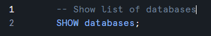
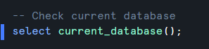

## Create Database

```sql
CREATE DATABASE DB_NAME;
```


&nbsp;

&nbsp;

## Show list of databases

```sql
SHOW databases;
```



&nbsp;

&nbsp;

```sql
use database one_year_exp_interview_practice;
```


&nbsp;

&nbsp;

## Check current database

```sql
select current_database();
```



&nbsp;

&nbsp;

## Drop database

```sql
DROP DATABASE database_name;
```


&nbsp;

&nbsp;

```sql

```

&nbsp;

&nbsp;

```sql

```

&nbsp;

&nbsp;

```sql

```

&nbsp;

&nbsp;

```sql

```

&nbsp;

&nbsp;

```sql

```

&nbsp;

&nbsp;

```sql

```

&nbsp;

&nbsp;

```sql

```

&nbsp;

&nbsp;

```sql

```

&nbsp;

&nbsp;

```sql

```

&nbsp;

&nbsp;

```sql

```

&nbsp;

&nbsp;

```sql

```

&nbsp;

&nbsp;

```sql

```

&nbsp;

&nbsp;

```sql

```

&nbsp;

&nbsp;

```sql

```

&nbsp;

&nbsp;

```sql

```

&nbsp;

&nbsp;

```sql

```

&nbsp;

&nbsp;

```sql

```

&nbsp;

&nbsp;

```sql

```

&nbsp;

&nbsp;

```sql

```

&nbsp;

&nbsp;

```sql

```

&nbsp;

&nbsp;

```sql

```

&nbsp;

&nbsp;

```sql

```

&nbsp;

&nbsp;

```sql

```

&nbsp;

&nbsp;

```sql

```

&nbsp;

&nbsp;

```sql

```

&nbsp;

&nbsp;

```sql

```

&nbsp;

&nbsp;

```sql

```

&nbsp;

&nbsp;
