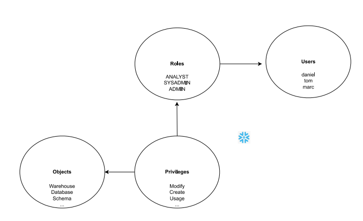

# Overview

- [Overview](#overview)
- [Core Objects in Snowflake](#core-objects-in-snowflake)
- [Compute \& Execution](#compute--execution)
- [Access \& Security](#access--security)
- [Advanced / Optional Objects](#advanced--optional-objects)
- [Flow of object](#flow-of-object)

&nbsp;

&nbsp;

&nbsp;

In Snowflake, objects are the various components or structures used to store, manage, and process data.

&nbsp;

&nbsp;

# Core Objects in Snowflake

| **Category**       | **Object Name**     | **Purpose / Description**                                 |
| ------------------ | ------------------- | --------------------------------------------------------- |
| **Data Container** | `DATABASE`          | Top-level container that holds schemas                    |
|                    | `SCHEMA`            | Logical grouping of tables, views, etc. inside a database |
|                    | `TABLE`             | Stores structured data (permanent, transient, temporary)  |
|                    | `VIEW`              | Virtual table based on a query                            |
|                    | `MATERIALIZED VIEW` | Stores results of a query, refreshes periodically         |
|                    | `EXTERNAL TABLE`    | Points to data stored outside Snowflake (e.g., S3)        |
|                    | `STAGE`             | Stores files for loading/unloading (internal/external)    |
|                    | `FILE FORMAT`       | Defines format of files (CSV, JSON, Parquet, etc.)        |

&nbsp;

&nbsp;

# Compute & Execution

| **Object Name** | **Purpose**                                                    |
| --------------- | -------------------------------------------------------------- |
| `WAREHOUSE`     | Virtual compute resource to run queries                        |
| `TASK`          | Scheduled jobs to automate SQL statements (ETL, refresh, etc.) |
| `PIPE`          | Used in Snowpipe for continuous data loading                   |
| `STREAM`        | Tracks DML changes (Change Data Capture)                       |

&nbsp;

&nbsp;

# Access & Security

| **Object Name** | **Purpose**                                     |
| --------------- | ----------------------------------------------- |
| `ROLE`          | Controls access to objects (RBAC model)         |
| `USER`          | Represents a person/service accessing Snowflake |
| `GRANT`         | Assigns privileges on objects to roles          |

&nbsp;

&nbsp;

# Advanced / Optional Objects

| **Object Name** | **Purpose**                                                   |
| --------------- | ------------------------------------------------------------- |
| `SEQUENCE`      | Generates auto-increment numbers                              |
| `FUNCTION`      | User-defined functions (UDFs) for custom logic                |
| `PROCEDURE`     | Blocks of SQL logic, often used in automation                 |
| `POLICY`        | Row Access & Masking Policies for security and governance     |
| `INTEGRATION`   | For connecting to external services (e.g., storage, identity) |

&nbsp;

&nbsp;

# Flow of object

&nbsp;

&nbsp;

&nbsp;

&nbsp;

&nbsp;

&nbsp;
