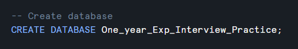
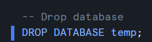

# Content

- [Content](#content)
  - [Create Database](#create-database)
  - [Create or replace a database](#create-or-replace-a-database)
  - [Show list of databases](#show-list-of-databases)
  - [Select / go to specific database](#select--go-to-specific-database)
  - [Check current database](#check-current-database)
  - [View database information](#view-database-information)
  - [Drop database](#drop-database)
  - [Rename a database](#rename-a-database)
  - [Add or update a comment](#add-or-update-a-comment)
  - [Create a database by cloning](#create-a-database-by-cloning)
  - [Create a database from a share](#create-a-database-from-a-share)
  - [Restore a dropped database](#restore-a-dropped-database)
  - [Find database metadata](#find-database-metadata)
  - [Grant access to a database](#grant-access-to-a-database)

&nbsp;

&nbsp;

&nbsp;

## Create Database

```sql
CREATE DATABASE DB_NAME;
```

Create only if it does not already exist

```sql
CREATE DATABASE IF NOT EXISTS  DB_NAME;
```



&nbsp;

&nbsp;

## Create or replace a database

```sql
CREATE OR REPLACE DATABASE DB_NAME;
```

> Warning: If the database already exists, this command replaces it. Existing objects may become inaccessible through the replaced database, so avoid it in production unless replacement is intentional.

&nbsp;

&nbsp;

## Show list of databases

```sql
SHOW databases;
```


&nbsp;

&nbsp;

## Select / go to specific database

```sql
use database one_year_exp_interview_practice;
```


After executing this query, `one_year_exp_interview_practice` becomes the current database for the session.

&nbsp;

&nbsp;

## Check current database

```sql
select current_database();
```


&nbsp;

&nbsp;

## View database information

```sql
DESCRIBE DATABASE DB_NAME;
```

&nbsp;

&nbsp;

## Drop database

```sql
DROP DATABASE database_name;
```



&nbsp;

&nbsp;

## Rename a database

```sql
ALTER DATABASE old_name
RENAME TO new_name;
```

&nbsp;

&nbsp;

## Add or update a comment

```sql
ALTER DATABASE db_name
SET COMMENT = 'any comment';
```

&nbsp;

Remove the comment:

```sql

ALTER DATABASE DB_NAME
UNSET COMMENT;
```

&nbsp;

&nbsp;

## Create a database by cloning

Snowflake supports zero-copy cloning:

```sql
CREATE DATABASE EMPLOYEE_DB_DEV
CLONE EMPLOYEE_ANALYTICS_DB;
```

This creates a development copy without immediately duplicating all underlying storage.

&nbsp;

&nbsp;

## Create a database from a share

```sql
CREATE DATABASE SHARED_DATA_DB
FROM SHARE PROVIDER_ACCOUNT.SHARE_NAME;
```

This is used when another Snowflake account shares data with your account.

&nbsp;

&nbsp;

## Restore a dropped database

If the database is still within its Time Travel retention period:

```sql
UNDROP DATABASE EMPLOYEE_ANALYTICS_DB;
```

&nbsp;

&nbsp;

## Find database metadata

```sql
SELECT
    database_name,
    database_owner,
    created,
    comment
FROM SNOWFLAKE.ACCOUNT_USAGE.DATABASES
WHERE deleted IS NULL
ORDER BY created DESC;
```

&nbsp;

&nbsp;

## Grant access to a database

```sql
GRANT USAGE
ON DATABASE EMPLOYEE_ANALYTICS_DB
TO ROLE DATA_ENGINEER_ROLE;
```

Database `USAGE` alone does not provide access to its schemas or tables. Those privileges must also be granted:

```sql
GRANT USAGE
ON SCHEMA EMPLOYEE_ANALYTICS_DB.RAW
TO ROLE DATA_ENGINEER_ROLE;

GRANT SELECT
ON ALL TABLES IN SCHEMA EMPLOYEE_ANALYTICS_DB.RAW
TO ROLE DATA_ENGINEER_ROLE;
```

&nbsp;

&nbsp;
