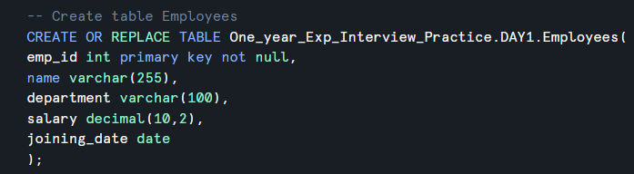
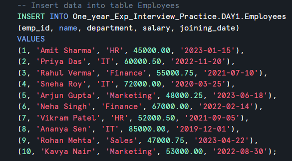
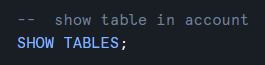
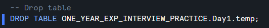

## Create table

```sql
-- Create table Employees
CREATE OR REPLACE TABLE db_name.schema_name.table_name(
col1 datatype constrains,
col2 datatype,
col3 datatype,
.....
);
```

&nbsp;

&nbsp;



&nbsp;

&nbsp;

## Insert data

```sql
INSERT INTO db_name.schema_name.table_name
(col1, col2, col3, ......., coln)
VALUES
(val11, val12, val13, ......., val1n),
(val21, val22, val23, ......., val3n),
....
(valn1, valn2, valn3, ......., valnn)
```



&nbsp;

&nbsp;

## fetch the data from table

```sql
SELECT * FROM db_name.schema_name.table_name;
```


&nbsp;

&nbsp;

## Show table in account

```sql
SHOW TABLES;
```



&nbsp;

&nbsp;

## Show table in account

```sql
SHOW TABLES;
```


&nbsp;

&nbsp;

## Show tables in particular database

```sql
SHOW TABLES in database db_name;
```


&nbsp;

&nbsp;

## Drop table

```sql
DROP TABLE DB_NAME.SCHEMA_NAME.TABLE_NAME;
```



&nbsp;

&nbsp;

&nbsp;

&nbsp;

&nbsp;

&nbsp;

&nbsp;

&nbsp;

&nbsp;
