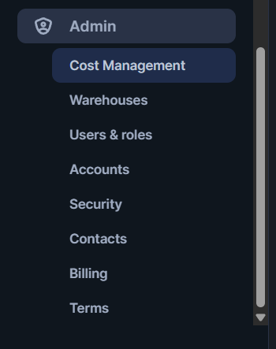

# Overview

- [Overview](#overview)
- [Projects](#projects)
  - [Worksheet](#worksheet)
    - [UI Vision](#ui-vision)
    - [Purpose](#purpose)
    - [Features](#features)
    - [Use Case](#use-case)
    - [Example](#example)
- [Data](#data)
- [Databases](#databases)
  - [Purpose](#purpose-1)
  - [Structure](#structure)
  - [UI Functionality](#ui-functionality)
  - [Example](#example-1)
- [Data Products](#data-products)
- [AI \& ML](#ai--ml)
- [Monitoring](#monitoring)
- [Admin](#admin)
  - [Sub-section of Admin](#sub-section-of-admin)
  - [Warehouses](#warehouses)
    - [UI Features](#ui-features)
    - [Size Options](#size-options)
    - [Use Case](#use-case-1)
    - [Tip](#tip)
  - [Roles](#roles)
    - [Purpose](#purpose-2)
    - [Features](#features-1)
    - [Use Case](#use-case-2)
    - [Example](#example-2)
- [Quick UI Navigation Summary](#quick-ui-navigation-summary)

&nbsp;

&nbsp;

&nbsp;

# Projects

Project section contains

- Worksheets
- Notebooks
- Streamlit
- Dashboards
- App Packages
- Templates
- Services and Jobs
- Workspaces

&nbsp;

&nbsp;

## Worksheet

### UI Vision

1. Sign in to Snowsight.
2. Select **Projects** > **Worksheets** to open the list of worksheets.
3. Open a worksheet.

&nbsp;

&nbsp;

### Purpose

Run SQL queries interactively.

&nbsp;

&nbsp;

### Features

- SQL editor with syntax highlighting
- un queries, view history and results
- Bind worksheet to a role, warehouse, and database/schema

&nbsp;

&nbsp;

### Use Case

Writing queries, testing logic, running transformations or DDLs.

&nbsp;

&nbsp;

### Example

```sql
SELECT * FROM MY_DB.PUBLIC.EMPLOYEES LIMIT 10;
```

&nbsp;

&nbsp;

&nbsp;

# Data

Data section contains

- Databases
- Add Data
- Integrations
- Migrations

&nbsp;

&nbsp;

# Databases

### Purpose

Logical containers for data objects (schemas, tables, views).

&nbsp;

&nbsp;

### Structure

```md
Database
┗━━ Schema
     ┗━━ Tables / Views / Streams / Tasks
```

&nbsp;

&nbsp;

### UI Functionality

- Browse databases and objects
- Create/edit/drop schemas and tables
- View table previews and metadata

&nbsp;

&nbsp;

### Example

Navigate to `MY_DB > PUBLIC > EMPLOYEES` to view a table.

&nbsp;

&nbsp;

&nbsp;

# Data Products

Marketplace
Apps
Private Sharing
Provider Studio
Partner Connect

&nbsp;

&nbsp;

&nbsp;

# AI & ML

&nbsp;

&nbsp;

&nbsp;

# Monitoring

- Query History
- Copy History
- Task History
- dbt projects
- Dynamic Tables
- Traces & Logs
- Trust Center
- Governance

&nbsp;

&nbsp;

&nbsp;

# Admin

When you log into Snowsight (Snowflake’s web UI), you’ll see an **Admin** tab on the left side.

This is the admin section



&nbsp;

From there, you can manage:

- **Users** → Create, edit, suspend users, assign roles.
- **Roles** → Manage role hierarchy, grant privileges.
- **Warehouses** → Create/modify warehouses, assign to roles.
- **Databases & Schemas** → Manage storage objects and permissions.
- **Resource Monitors** → Monitor credit usage.
- **Integrations** → Manage external stages, notification services, API integrations.
- **Accounts** (for ACCOUNTADMIN) → View account usage, billing, security policies.

&nbsp;

## Sub-section of Admin

Admin section consist of

1. Cost Management
2. Warehouses
3. Users & Roles
4. Accounts
5. Security
6. Contacts
7. Billing
8. Terms
9. &nbsp;

&nbsp;

&nbsp;

## Warehouses

Purpose: Compute engines that process SQL queries.

&nbsp;

&nbsp;

### UI Features

- Start/stop warehouses manually
- Set auto-suspend & auto-resume
- Monitor usage (credits consumed, status)

&nbsp;

&nbsp;

### Size Options

XS, S, M, L, XL, etc.

&nbsp;

&nbsp;

### Use Case

Choose the right warehouse based on query complexity and concurrency.

&nbsp;

&nbsp;

### Tip

Use `auto-suspend = 60 sec` to save cost.

&nbsp;

&nbsp;

&nbsp;

## Roles

### Purpose

Manage RBAC (Role-Based Access Control).

&nbsp;

&nbsp;

### Features

- Switch between roles from top-right dropdown
- Each role has privileges (e.g., read/write on databases, create warehouse)
- Roles are assigned to users

&nbsp;

&nbsp;

### Use Case

Control access to data and operations.

&nbsp;

&nbsp;

### Example

A role like `ANALYST` may only have SELECT access on views.

&nbsp;

&nbsp;

&nbsp;

&nbsp;

&nbsp;

&nbsp;

&nbsp;

# Quick UI Navigation Summary

| **Section**    | **What You Do There**                               |
| -------------- | --------------------------------------------------- |
| **Worksheets** | Write/run SQL queries                               |
| **Databases**  | Explore schemas, tables, views                      |
| **Warehouses** | Manage compute (start/stop, size, suspend settings) |
| **Roles**      | Switch role context to change access permissions    |
| **History**    | View query execution history and details            |
| **Admin**      | Manage users, roles, resource monitors, parameters  |
