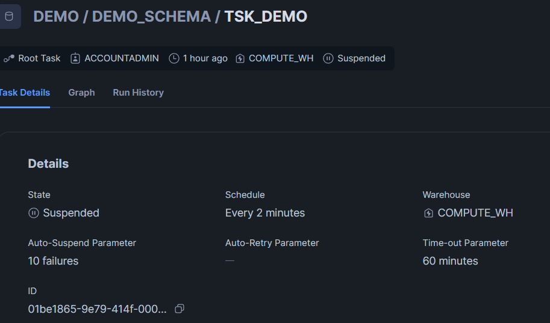

# Overview

- [Overview](#overview)
- [Create a Scheduled Task](#create-a-scheduled-task)
  - [Syntax](#syntax)
  - [Example](#example)
    - [Note](#note)
    - [Query breakdown](#query-breakdown)

&nbsp;

&nbsp;

&nbsp;

# Create a Scheduled Task

## Syntax

```sql
CREATE OR REPLACE TASK <database_name>.<schema_name>.<task_name>
    warehouse = '<wh_name>'
    schedule = '<schedule_time>'
    as <sql>
```

&nbsp;
Update target When new data will be inserted

```sql
CREATE OR REPLACE TASK DEMO.DEMO_SCHEMA.TSK_DEMO
  WAREHOUSE = 'COMPUTE_WH'
  SCHEDULE = '1 MINUTE'
AS
INSERT INTO DEMO.DEMO_SCHEMA.TARGET_TABLE
SELECT *
FROM DEMO.DEMO_SCHEMA.DEMO_TABLE src
WHERE NOT EXISTS (
  SELECT 1
  FROM DEMO.DEMO_SCHEMA.TARGET_TABLE tgt
  WHERE tgt.ROLL_NO = src.ROLL_NO  -- <-- Match on unique column!
);
```

&nbsp;

&nbsp;

## Example

```sql
CREATE OR REPLACE TASK DEMO.DEMO_SCHEMA.TSK_DEMO
    warehouse = 'COMPUTE_WH'
    schedule = '2 MINUTE'
    as
    INSERT INTO TARGET_TABLE
    SELECT * FROM DEMO.DEMO_SCHEMA.DEMO_TABLE;
```

&nbsp;



&nbsp;

### Note

🛑 Don't forget: After creating, resume the task

```sql
ALTER TASK task_name RESUME;
```

&nbsp;

&nbsp;

### Query breakdown

| Part                                                                  | Meaning                                                                                           |
| --------------------------------------------------------------------- | ------------------------------------------------------------------------------------------------- |
| `CREATE TASK`                                                         | Creates a new task object in Snowflake.                                                           |
| `OR REPLACE TASK`                                                     | If the task already exists, it replaces it with the new definition.                               |
| `<database_name>.<schema_name>.<task_name>`                           | The name you assign to the task (must be unique within the schema).                               |
| `WAREHOUSE`                                                           | Specifies which virtual warehouse to use to execute the task.                                     |
| `wh_name`                                                             | Replace with the actual warehouse name. The warehouse must be running or auto-resume enabled.     |
| `SCHEDULE`                                                            | Defines the frequency of task execution.                                                          |
| `'1 MINUTE'`                                                          | The task will run every minute. You can also use CRON format like `'USING CRON 0 9 * * * UTC'`.   |
| `AS`                                                                  | Begins the SQL body of the task.                                                                  |
| `INSERT INTO TARGET_TABLE SELECT * FROM DEMO.DEMO_SCHEMA.DEMO_TABLE;` | The actual work the task does — in this case, inserts data from `DEMO_TABLE` into `TARGET_TABLE`. |

&nbsp;

&nbsp;

&nbsp;

&nbsp;

&nbsp;

&nbsp;

&nbsp;

&nbsp;

&nbsp;
