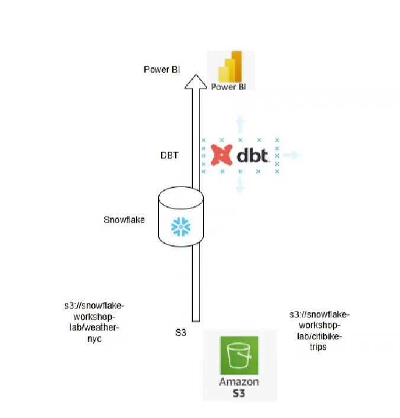

# Overview

- [Overview](#overview)
- [Summary](#summary)
- [Abbreviation](#abbreviation)
- [DBT](#dbt)
  - [Notes](#notes)
- [Features](#features)
- [Data Flow of Modern Data Stack](#data-flow-of-modern-data-stack)
- [Where dbt fits in the Modern Data Stack](#where-dbt-fits-in-the-modern-data-stack)
- [What does dbt do / Use of dbt](#what-does-dbt-do--use-of-dbt)
- [How does dbt work?](#how-does-dbt-work)
- [Example Workflow](#example-workflow)

&nbsp;

&nbsp;

&nbsp;

# Summary

- dbt = T in ELT
- Write SQL, structure projects like codebases
- Supports modular pipelines, testing, and documentation
- Works well with cloud data warehouses
- Makes transformation scalable, repeatable, and collaborative

&nbsp;

&nbsp;

# Abbreviation

- DBT = Data Build Tool
- ETL = Extract Transform Load

&nbsp;

&nbsp;

# DBT

DBT is the tool for **_transforming data_** within data warehouse.

DBT (data build tool) is an **open-source** tool that helps data teams **transform raw data** into clean, analytics-ready datasets using SQL inside a data warehouse .

It is used to transform, test, document, and manage data inside a data warehouse or data platform.

&nbsp;

It's a command line tool and transformation framework, used by data engineers and analysts to transform data in a data warehouse using SQL and some basic Python (for dbt Python models or scripting).

&nbsp;

&nbsp;

## Notes

Data warehouse = any of the modern data platforms like **Snowflake**, **Redshift**, **BigQuery**, **DataBricks**.

DBT only focus on **T** i.e transforming raw data into actionable insights.

The **extraction** of data from source and **loading** raw data into data warehouse are completed using some other tools.

&nbsp;

&nbsp;

# Features

1. <u>**_Maintainability:_**</u> Organize hundreds of SQL transformations into a structured project.

2. <u>**_Reusability:_**</u> Use models as dependencies rather than repeatedly writing SQL.

3.  <u>**_Testing:_**</u> Automate data-quality checks.

4.   <u>**_Documentation:_**</u> Document models and columns.

5.    <u>**_Lineage:_**</u> Understand upstream/downstream dependencies.

6. <u>**_Affordable:_**</u> DBT is more Affordable

7.  <u>**_free open source:_**</u> It offers free open source version

6. <u>**_No specialized skill required:_**</u> DBT primarily uses SQL, which is a familiar language. So no specialized skill requires.

7. <u>**_Takes full advantage of modern cloud data platform:_**</u> Modern cloud data platform like Redshift, BigQuery, Snowflake and DataBricks come with significant processing power. With its ETL approach and low local resource requirements DBT take full advantage of these modern cloud data platform

8. <u>**_Build-in Features:_**</u> DBT offers several build-in features such as **Version control**, **Automated Testing**, **Document Generating**, and **Data lineage visualization**. These features can ensure that the data transformations are reliable and maintainable over time even if data volumes and complexity grow.

9. <u>**_Easy Team Collaboration:_**</u> DBT allows large data team to collaborate easily by providing **integrated platform for coding, testing, documentation and development**

&nbsp;

&nbsp;

# Data Flow of Modern Data Stack

In a modern data stack, data generally flows like this:

- **Data Ingestion** — Tools like **Fivetran**, **Airbyte**, or **custom scripts** load raw data into your warehouse.

- **Data Storage** — Cloud data warehouses like **Snowflake**, **BigQuery**, **Redshift**, or **Databricks** store the raw data.

- **Data Transformation** — This is where **dbt** comes in. It transforms raw data into clean, tested, documented datasets.

- **BI / Analytics Layer** — Tools like **Looker**, **Tableau**, or **Power BI** use transformed data to generate dashboards and insights.

&nbsp;



&nbsp;

| Task                         | Done by dbt?                   | Description                               |
| ---------------------------- | ------------------------------ | ----------------------------------------- |
| Extract from source          | ❌                             | Done by tools like Fivetran, Airbyte      |
| Load to warehouse            | ❌                             | Done by EL tools or pipelines             |
| Transform data (clean, join) | ✅                             | dbt writes SQL models to do this          |
| Test data                    | ✅                             | dbt can test for nulls, duplicates, etc.  |
| Document data                | ✅                             | dbt generates docs and lineage            |
| Schedule transformation      | ✅ (with dbt Cloud or Airflow) | Automate dbt runs                         |
| Serve data to dashboards     | ❌                             | That’s for BI tools like Tableau/Power BI |
|                              |                                |                                           |

&nbsp;

&nbsp;

# Where dbt fits in the Modern Data Stack

```text
                ┌────────────┐
                │  Source DB │ ← Your app or external data
                └─────┬──────┘
                      │
         ┌────────────▼────────────┐
         │       EL (e.g. Fivetran)│ ← Extract + Load
         └────────────┬────────────┘
                      │
             ┌────────▼────────┐
             │  Data Warehouse │ ← BigQuery, Snowflake, Redshift, etc.
             └────────┬────────┘
                      │
              ┌───────▼───────┐
              │     dbt       │ ← Transforms raw data into models
              └───────┬───────┘
                      │
            ┌─────────▼─────────┐
            │  Analytics Tools  │ ← Looker, Power BI, Tableau, etc.
            └───────────────────┘
```

&nbsp;

&nbsp;

# What does dbt do / Use of dbt

dbt lets you:

- **SQL transformations**: Write SQL to **transform raw data** into clean, usable datasets.
- **Dependency management** : dbt understands the dependencies. If `{{ ref('stg_customers') }}` is used inside a model, dbt knows that `stg_customers` must be built before the current model.
- Automatically create **data lineage graph** that shows dependencies between data models.
- Organize SQL transformations like code (modular, reusable).
- **Test and document** your data pipelines.
- Version control your transformations (using Git).
- Schedule & Automate Jobs, monitor job status

&nbsp;

&nbsp;

# How does dbt work?

- You write SQL models (`SELECT` statements) and save them in `.sql` files.
- dbt compiles those files into `CREATE TABLE AS SELECT` or `CREATE VIEW` statements.
- It runs them on your data warehouse (like `Snowflake`, `BigQuery`, `Redshift`, `Databricks`).
- dbt builds a `DAG` (directed acyclic graph) of all dependencies between models.

&nbsp;

&nbsp;

# Example Workflow

You could have:

- **stg_orders.sql** → stages raw orders data
- **int_orders_cleaned.sql** → intermediate cleaned data
- **fct_orders.sql** → final fact table

&nbsp;

&nbsp;

# What problem does dbt solve?

dbt solves the problem of managing SQL-based data transformations at scale.

In a traditional data warehouse environment, we may have many SQL scripts with manually managed dependencies, limited testing, duplicated transformation logic, poor documentation, and difficult deployment processes.

dbt provides a structured framework for managing these transformations as models. It uses ref() and source() to manage dependencies and build a DAG, provides automated data-quality testing and documentation, and integrates with Git and CI/CD for controlled deployment.

In a modern architecture, ingestion tools load data into Snowflake, and dbt manages the transformation layer that converts raw data into reliable, analytics-ready datasets.

&nbsp;

| Problem                       | dbt Solution                                 |
| ----------------------------- | -------------------------------------------- |
| Too many SQL scripts          | Structured dbt models                        |
| Manual dependencies           | `ref()` + DAG                                |
| Hard-coded table references   | `ref()` / `source()`                         |
| Unknown execution order       | Dependency graph                             |
| Poor data quality             | Automated tests                              |
| Poor documentation            | Model/column documentation                   |
| Difficult lineage             | DAG / lineage                                |
| Repeated transformation logic | Reusable models                              |
| Difficult deployment          | Git + CI/CD                                  |
| Large data volumes            | Incremental models                           |
| Difficult model selection     | `--select`, tags, selectors                  |
| Environment differences       | dbt configurations / target-aware references |

&nbsp;

&nbsp;


# The concepts of DBT

| Priority | Concept                     | Importance   |
| -------- | --------------------------- | ------------ |
| 🔴 1     | What is a model?            | Must know    |
| 🔴 2     | `ref()`                     | Must know    |
| 🔴 3     | `source()`                  | Must know    |
| 🔴 4     | DAG/dependencies            | Must know    |
| 🔴 5     | Materializations            | Must know    |
| 🔴 6     | Incremental models          | Must know    |
| 🔴 7     | Tests                       | Must know    |
| 🟠 8     | Model configuration         | Important    |
| 🟠 9     | YAML/properties             | Important    |
| 🟠 10    | Lineage                     | Important    |
| 🟠 11    | Model selection             | Important    |
| 🟠 12    | `is_incremental()` / `this` | Important    |
| 🟡 13    | Tags                        | Good to know |
| 🟡 14    | Aliases                     | Good to know |
| 🟡 15    | Model contracts             | Advanced     |
| 🟡 16    | Ephemeral models            | Advanced     |

