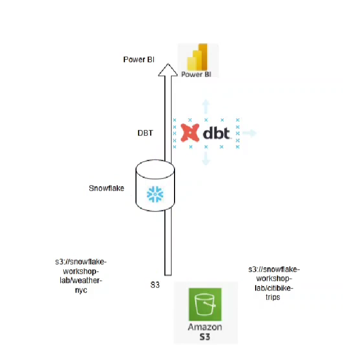

# Flow of data

&nbsp;

&nbsp;

This diagram shows a modern data pipeline workflow using Amazon S3 → Snowflake → dbt → Power BI.

&nbsp;

# Flow Explanation (Short & Simple)

1. Amazon S3:

   Raw data is stored in S3 buckets.

   - Example paths:
     - s3://snowflake-workshop-lab/weather-nyc
     - s3://snowflake-workshop-lab/citibike-trips

2. Snowflake:

   Data is ingested from S3 into Snowflake for processing and storage.

3. dbt (Data Build Tool):

   dbt connects to Snowflake and applies SQL-based transformations — like cleaning, joining, filtering — to raw data.

4. Power BI:

   Transformed data from Snowflake is finally visualized in Power BI dashboards and reports for analysis.

&nbsp;

&nbsp;

# In One Line:

Raw data from S3 → loaded into Snowflake → transformed using dbt → visualized in Power BI.

&nbsp;

&nbsp;

# ELT process

| **ELT Step**     | **Tool/Process Used**                       | **What Happens**                                            |
| ---------------- | ------------------------------------------- | ----------------------------------------------------------- |
| ✅ **Extract**   | **Amazon S3** → Snowflake (via `COPY INTO`) | Raw data is extracted from S3 buckets (CSV, Parquet, etc.). |
| ✅ **Load**      | **Snowflake**                               | Data is loaded into raw/staging tables inside Snowflake.    |
| ✅ **Transform** | **dbt (on Snowflake)**                      | SQL models apply cleaning, joins, business logic, etc.      |
