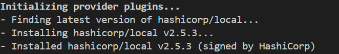

# Overview

- [Overview](#overview)
- [Provider](#provider)
- [Tiers of providers](#tiers-of-providers)
- [Functionality](#functionality)
- [Common Providers](#common-providers)
- [Provider Block Syntax](#provider-block-syntax)
- [List All Providers in Use](#list-all-providers-in-use)
  - [This will show](#this-will-show)
- [Plugin versions](#plugin-versions)

&nbsp;

&nbsp;

&nbsp;

# Provider

Providers are the bridge between Terraform and the external infrastructure.

A provider is a plugin that allows Terraform to manage and interact with external APIs or services (like AWS, Azure, GitHub, Kubernetes, etc.).

When we run `terraform init` terraform will download and install all the plugins for the providers to use with any configuration.

&nbsp;

&nbsp;

# Tiers of providers

There are three tiers of providers.

1. Official : AWS, GCP, Azure, local, vault, Docker, GitHub, MySQL, etc.
2. Partner : digitalocean, heroku, bigip
3. Community : Hashicups, activedirectory, ucloud

AWS, Azure, Google Cloud, Docker, GitHub, MySQL, etc.

&nbsp;

# Functionality

They expose resources and data sources (like aws_instance, azurerm_resource_group, etc.)

&nbsp;

&nbsp;

# Common Providers

| Provider     | Use Case                                            |
| ------------ | --------------------------------------------------- |
| `aws`        | Manage AWS infrastructure                           |
| `azurerm`    | Manage Microsoft Azure resources                    |
| `google`     | Manage Google Cloud Platform (GCP)                  |
| `kubernetes` | Manage Kubernetes clusters and resources            |
| `docker`     | Manage Docker containers and images                 |
| `vault`      | Manage secrets with HashiCorp Vault                 |
| `local`      | Manage local files and directories                  |
| `random`     | Generate random strings, numbers, etc.              |
| `null`       | Used for testing or when no real resource is needed |

&nbsp;

&nbsp;

# Provider Block Syntax

```hcl
terraform {
  required_providers {
    aws = {
      source  = "hashicorp/aws"
      version = "~> 5.0"
    }
  }
}

provider "aws" {
  region = "us-west-2"
}
```

&nbsp;

&nbsp;

# List All Providers in Use

You can run:

```bash
terraform providers
```

&nbsp;

## This will show

- Providers required
- Providers used in modules
- Source and version of each

&nbsp;

&nbsp;

# Plugin versions

When we run `terraform init` terraform will download and install all the plugins for the providers to use with any configuration.

&nbsp;



&nbsp;

hashicrop = organizational namespace

local = type

&nbsp;

&nbsp;

&nbsp;

&nbsp;
