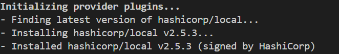

# Overview

- [Overview](#overview)
- [Provider](#provider)
- [Tiers of providers](#tiers-of-providers)
- [What Does a Provider Do](#what-does-a-provider-do)
- [Functionality](#functionality)
- [Common Providers](#common-providers)
- [Provider Block Syntax](#provider-block-syntax)
- [How Terraform Installs Providers](#how-terraform-installs-providers)
- [List All Providers in Use](#list-all-providers-in-use)
  - [This will show](#this-will-show)

&nbsp;

&nbsp;

&nbsp;

# Provider

Providers are the **bridge between Terraform and the external infrastructure**.

A provider is a plugin that allows Terraform to manage and interact with external APIs or services (like AWS, Azure, GitHub, Kubernetes, etc.).

Without a provider, Terraform cannot create or manage any resources.

&nbsp;

&nbsp;

# Tiers of providers

There are three tiers of providers.

1. Official : AWS, GCP, Azure, local, vault, Docker, GitHub, MySQL, etc.
2. Partner : digitalocean, heroku, bigip
3. Community : Hashicups, activedirectory, ucloud

&nbsp;

&nbsp;

# What Does a Provider Do

A provider is responsible for:

| Responsibility        | Meaning                                                     |
| --------------------- | ----------------------------------------------------------- |
| **Authentication**    | Connect to service (AWS keys, Azure login, Snowflake creds) |
| **API Communication** | Send requests to cloud/SaaS API                             |
| **Resource Schema**   | Define what fields exist in a resource                      |
| **CRUD operations**   | Create, Read, Update, Delete resources                      |
|                       |                                                             |

&nbsp;

&nbsp;

# Functionality

They expose resources and data sources (like aws_instance, azurerm_resource_group, etc.)

&nbsp;

&nbsp;

# Common Providers

| Provider     | Use Case                                            |
| ------------ | --------------------------------------------------- |
| `aws`        | Manage AWS infrastructure                           |
| `azurerm`    | Manage Microsoft Azure resources                    |
| `google`     | Manage Google Cloud Platform (GCP)                  |
| `kubernetes` | Manage Kubernetes clusters and resources            |
| `docker`     | Manage Docker containers and images                 |
| `vault`      | Manage secrets with HashiCorp Vault                 |
| `local`      | Manage local files and directories                  |
| `random`     | Generate random strings, numbers, etc.              |
| `null`       | Used for testing or when no real resource is needed |
| `Snowflake`  | Manages Snowflake                                   |
|              |                                                     |

&nbsp;

&nbsp;

# Provider Block Syntax

```hcl
terraform {
  required_providers {
    aws = {
      source  = "hashicorp/aws"
      version = "~> 5.0"  # specifying version
    }
  }
}

provider "aws" {
  region = "us-west-2"
}
```

&nbsp;

This tells Terraform:

- Install the AWS provider
- Authenticate using credentials
- Create/modify AWS resources in that region

&nbsp;

&nbsp;

# How Terraform Installs Providers

When we run `terraform init` terraform will download and install all the plugins for the providers to use with any configuration.

```bash
terraform init
```

&nbsp;

Terraform will:

- Download provider plugin
- Install it in `.terraform/providers/`
- Initialize backend configs

&nbsp;



- hashicrop = organizational namespace
- local = type

&nbsp;

&nbsp;

# List All Providers in Use

You can run:

```bash
terraform providers
```

&nbsp;

### This will show

- Providers required
- Providers used in modules
- Source and version of each

&nbsp;

&nbsp;
